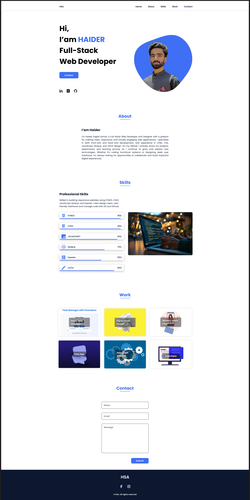

#  Figma Portfolio Website Design

A clean and modern personal portfolio website designed in **Figma**. This project was created to showcase personal branding, skills, projects, and contact information with an emphasis on layout clarity, responsiveness, and visual hierarchy.

---

##  Features

* Hero section with name, title, and CTA buttons  
* About section with personal description  
* Skills/Technologies grid layout  
* Projects section with visual thumbnails and link placeholders  
* Contact form layout for easy user messaging  
* Mobile-friendly and responsive layout consideration  
* Footer with social links and copyright

---

##  Design Stack

* **Design Tool:** Figma  
* **Design Style:** Clean, responsive, personal branding  
* **File Format:** `.fig` (Figma source file)

---

##  Folder Structure

```

figma-portfolio-website-design/
├── portfolio-website-design.fig       # Original Figma file
├── preview.png                # Exported preview image
└── README.md                  # This documentation file

```

---

##  Getting Started

###  View the Design Online

You can view the portfolio template directly in Figma:

[**Live Figma File**](https://www.figma.com/design/Fst2wbQoHDckGwE3DAEhm3/Portfolio-Website-Design?t=ZM1F85Le0ozaU1yf-1)

###  Use the `.fig` File Locally

1. Go to [https://figma.com](https://figma.com)  
2. Click **Import File** from your Figma dashboard  
3. Upload the `portfolio-design.fig` file  
4. Start customizing the design for your own use!

---

##  Purpose

This design was built to:

* Practice personal portfolio layout and visual identity  
* Serve as a design-to-code reference for frontend development  
* Showcase knowledge of layout, spacing, and hierarchy in UI/UX

---

##  Preview



##  Future Plans

* Develop the design into a fully responsive HTML/CSS website  
* Add animation and interactivity using JavaScript or React  
* Deploy to GitHub Pages or Vercel  
* Build multiple themes or layout variations

---

##  Contributing

If you'd like to improve this portfolio design or adapt it for different use cases:

1. Fork the repository  
2. Create a new branch (`git checkout -b feature/new-layout`)  
3. Commit your changes  
4. Push to GitHub and open a Pull Request

---

##  Contact

Created by **Haider Sajjad Azmat – HSA‑ATTOCK**  
Open to collaboration, feedback, or project inquiries!

GitHub: [@HSA-ATTOCK](https://github.com/HSA-ATTOCK)

---
